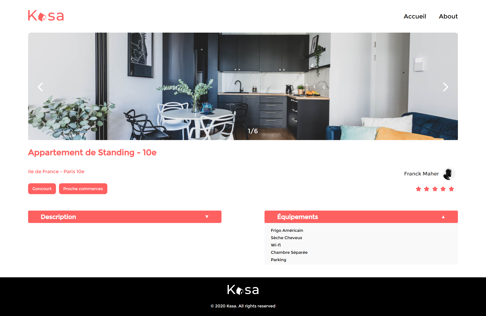
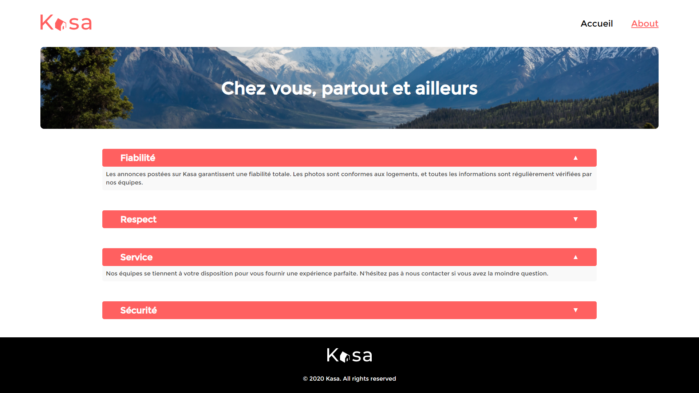

# Kasa : Apartment Rental Agency

[Lire ce fichier en français](#kasa--agence-de-location-des-logements)

## Description

Kasa is a platform for renting apartments between individuals. This project involves a complete redesign of the Kasa website using React and React Router.

### Features

-   **Ad Management** : Display rental ads with their details.

-   **Navigation** : Utilisation de React Router pour la navigation entre les différentes pages du site.

## Technologies Used

## Design

The application design is fully responsive, ensuring an optimal user experience across all devices, from desktops to smartphones.

### Screenshots

Here are some screenshots that illustrate the final result of the site:

## Installation

Follow these steps to install and run the Kasa project on your local machine for development and testing.

### Prerequisites

Make sure you have Node.js and npm installed on your machine. If not, you can download and install them from the [Node.js official website](https://nodejs.org/).

### Cloning the Repository

Open your terminal and type the following command to clone the GitHub repository:

`git clone https://github.com/IbrahimAlsabr/Kasa.git`

### Installing Dependencies

Change the directory to access the cloned project folder and install the necessary dependencies:

`cd Kasa`

`npm install`

### Starting the Application

To start the application, run the following command in the terminal: `npm run dev`

Access the application via `http://localhost:5173`.

## Author

### Ibrahim Alsabr

  

---

---

---

---

 

# Kasa : Agence de Location des Logements

[Read this file in English](#kasa--apartment-rental-agency)

## Description

Kasa est une plateforme de location d'appartements entre particuliers. Ce projet consiste en la refonte complète du site web de Kasa en utilisant React et React Router.

### Fonctionnalités

-   **Gestion des annonces** : Affichage des annonces de locations avec leurs détails.

-   **Navigation** : Utilisation de React Router pour la navigation entre les différentes pages du site.

## Technologies Utilisées

## Design

Le design de l'application est entièrement responsive, garantissant une expérience utilisateur optimale sur tous les appareils, des ordinateurs de bureau aux smartphones

### Captures d'écran

Voici quelques captures d'écran qui illustrent le résultat final du site :

## Installation

Suivez ces étapes pour installer et exécuter le projet Kasa sur votre machine locale pour le développement et les tests.

### Prérequis

Assurez-vous d'avoir Node.js et npm installés sur votre machine. Si ce n'est pas le cas, vous pouvez les télécharger et les installer depuis [Node.js official website](https://nodejs.org/).

### Clonage du dépôt

Ouvrez votre terminal et tapez la commande suivante pour cloner le dépôt GitHub :
`git clone https://github.com/IbrahimAlsabr/Kasa.git`

### Installation des dépendances

Changez de répertoire pour accéder au dossier du projet cloné et installez les dépendances nécessaires :

`cd Kasa`

`npm install`

### Lancement de l'application

Pour démarrer l'application, exécutez la commande suivante dans le terminal : `npm run dev`

Accédez à l'application via `http://localhost:5173`.

## Auteur

### Ibrahim Alsabr

  
